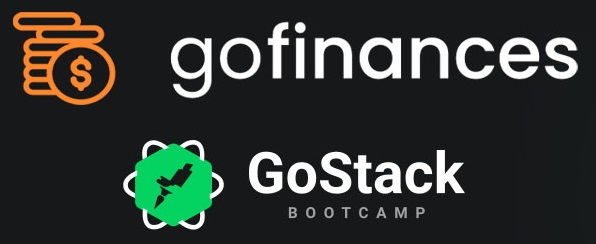

<h1 align="center">
    
    <br>
    Go Finances - ReactJS
</h1>

<h4 align="center">
  Sistema desenvolvido utilizando a tecnologia ReactJS.
</h4>

<p align="center">
  <a href="#tecnologias">Tecnologias</a>
  <a href="#como_usar">Como Usar</a>
  <a href="#informacoes">Informações</a>
</p>

<p align="center">
  
</p>

## Tecnologias

Este projeto foi desenvolvido no [Bootcamp GoStack da RocketSeat](https://rocketseat.com.br/bootcamp) com as seguintes tecnologias:

- [ReactJS](https://reactjs.org/)
- [Axios](https://github.com/axios/axios)
- [react-router-dom](https://reacttraining.com/react-router/web/guides/quick-start)
- [styled-components](https://www.styled-components.com/)
- [VS Code][vc] com [EditorConfig][vceditconfig], [ESLint][vceslint] e [Prettier][vcprettier]

## Como Usar

Para clonar e executar este aplicativo, você precisará [Git](https://git-scm.com), [Node.js v12.16.2][nodejs] ou superior + [Yarn 1.22.4][yarn] ou superior instalado no seu computador. Executar no seu terminal ou prompt de comando:

```bash
# Para clonar este repositório
$ git clone https://github.com/osterloh/GoStack_Level03_ChallengeReactJS.git

# Entrar no repositório
$ cd GoStack_Level03_ChallengeReactJS

# Instalar as dependências
$ yarn

#  Executar o sistema
$ yarn start
```

---

Desenvolvido por [Johnatan Luiz Osterloh](https://www.linkedin.com/in/johnatanosterloh/)

[nodejs]: https://nodejs.org/
[yarn]: https://yarnpkg.com/
[vc]: https://code.visualstudio.com/
[vceditconfig]: https://marketplace.visualstudio.com/items?itemName=EditorConfig.EditorConfig
[vceslint]: https://marketplace.visualstudio.com/items?itemName=dbaeumer.vscode-eslint
[vcprettier]: https://prettier.io/
